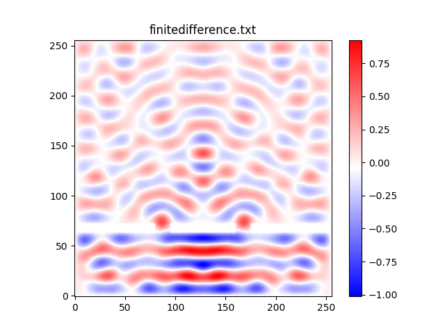

# serial version：

**seq is a file related to serial code, including the following files:**

1. **seq.c**: The main file of the serial version. The function of saving data is to make the simulation more visual, but it takes a lot of time, so when measuring the program running time, it is necessary to comment the following code:

   ```c
           // Save state for plotting in real time
           if (plotRealTime || t >= tEnd) {
               char filename[50];
               sprintf(filename, "%s/output_%d.txt", dirName, outputCount);
               save_to_file(U, mask, N, filename);
               outputCount++;
           }
   ```

2. **final_show.py**: draws a graph based on the final data saved in finitedifference.txt.

3. **outputdata_show.py**: Dynamically simulates the data generated by all the calculation processes saved in the outputdata file. If you need to save the data and simulate dynamically, remember to adjust the relevant code in seq.c.

4. **html**: Documentation generated with Doxygen.

**Example output image of the serial version:**



# openMP verion
**openMP is a file related to openMP version code, including the following files:**
1. **openMPtest.c**: The main file of the openMP version. After running, the program will output the run time and create an output.txt file, which contains the simulation data at time t for plotting. To correctly obtain the OpenMP parallel computation results, use the following commands to compile and run the program on Dardel.

```bash
# Compile the program with OpenMP support
cc -fopenmp openMPtest.c -o OPENMP

# Change N to set the number of OpenMP threads. 
export OMP_NUM_THREADS = N

# Run the program using srun
srun -n 1 ./OPENMP
```
2. **plot.py**: Draws a graph based on the final data saved in output.txt.


3. **html**: Documentation generated with Doxygen.
# MPI version
**MPI is a folder related to MPI version code, including the following files:**
